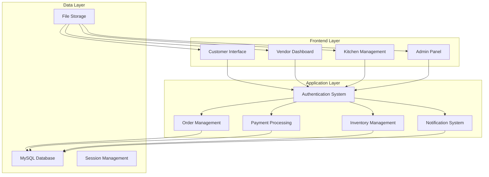

# 🍔 ORDIVO - Multi-Vendor Food Delivery Platform

<div align="center">


**A comprehensive multi-vendor food and grocery delivery platform designed for the Bangladeshi market**

[](https://php.net)
[](https://mysql.com)
[](https://getbootstrap.com)
[](LICENSE)

[🚀 Live Demo](#-live-demo) • [📖 Documentation](#-documentation) • [🛠️ Installation](#️-installation) • [🤝 Contributing](#-contributing)

</div>

---

## 📋 Table of Contents

- [🌟 Features](#-features)
- [🏗️ System Architecture](#️-system-architecture)
- [👥 User Roles](#-user-roles)
- [🛠️ Installation](#️-installation)
- [⚙️ Configuration](#️-configuration)
- [📁 Project Structure](#-project-structure)
- [🔐 Security Features](#-security-features)
- [📱 Mobile Responsiveness](#-mobile-responsiveness)
- [🎨 UI/UX Features](#-uiux-features)
- [🔧 Technical Stack](#-technical-stack)
- [📊 Analytics & Reporting](#-analytics--reporting)
- [🚀 Live Demo](#-live-demo)
- [📖 Documentation](#-documentation)
- [🤝 Contributing](#-contributing)
- [📄 License](#-license)

---

## 🌟 Features

### 🛒 **Customer Experience**
- **Modern Homepage**: ORDIVO-inspired design with animated logo and smooth interactions
- **Smart Search**: Real-time autocomplete with product, vendor, and category suggestions
- **Product Discovery**: Featured products, top choices, and category-based browsing
- **Detailed Product Pages**: Comprehensive product information with image galleries
- **Shopping Cart**: Persistent cart with localStorage integration
- **Favorites System**: Save and manage favorite products
- **Order Tracking**: Real-time order status updates
- **Wallet Integration**: Digital wallet with multiple payment methods
- **Address Management**: Multiple delivery addresses with location services
- **Review System**: Rate and review products and vendors

### 🏪 **Vendor Management**
- **Complete Business Profile**: Restaurant/shop management with cover photos
- **Product Catalog**: Full product management with categories and variants
- **Order Processing**: Real-time order management and status updates
- **Staff Management**: Kitchen and store staff coordination
- **Inventory Tracking**: Stock management with low-stock alerts
- **Analytics Dashboard**: Sales, performance, and customer insights
- **Promotional Tools**: Coupons, discounts, and marketing campaigns

### 👨‍🍳 **Kitchen Operations**
- **Order Queue Management**: Streamlined kitchen workflow
- **Inventory Management**: Real-time stock tracking with FIFO system
- **Staff Coordination**: Kitchen staff scheduling and task management
- **Recipe Management**: Ingredient tracking and preparation guidelines
- **Quality Control**: Waste tracking and quality assurance
- **Performance Analytics**: Kitchen efficiency and productivity metrics

### 🔧 **Admin Panel**
- **User Management**: Complete user lifecycle management
- **Vendor Onboarding**: Vendor approval and verification process
- **System Analytics**: Comprehensive business intelligence dashboard
- **Content Management**: Categories, products, and promotional content
- **Financial Oversight**: Transaction monitoring and commission tracking
- **Security Management**: User activity logs and security controls

---

## 🏗️ System Architecture



---

## 👥 User Roles

| Role | Access Level | Key Features |
|------|-------------|--------------|
| 🔧 **Super Admin** | Full System Control | User management, vendor approval, system analytics, security oversight |
| 🏪 **Vendor** | Business Management | Product catalog, order processing, staff management, sales analytics |
| 👨‍🍳 **Kitchen Manager** | Kitchen Operations | Order workflow, inventory management, staff coordination, quality control |
| 👩‍🍳 **Kitchen Staff** | Order Preparation | Order queue, recipe viewing, inventory usage, preparation tracking |
| 🏬 **Store Manager** | Store Operations | Store oversight, inventory management, staff coordination, sales tracking |
| 👥 **Store Staff** | Store Support | Order processing, inventory updates, customer interaction, task management |
| 🚚 **Delivery Rider** | Delivery Operations | Order assignments, route optimization, delivery tracking, earnings |
| 🛒 **Customer** | Shopping & Ordering | Browse products, place orders, track deliveries, manage profile |

---

## 🛠️ Installation

### Prerequisites

- **PHP 8.0+** with extensions: `mysqli`, `gd`, `curl`, `json`, `mbstring`
- **MySQL 8.0+** or **MariaDB 10.4+**
- **Apache 2.4+** or **Nginx 1.18+**
- **Composer** (for dependency management)
- **Node.js 16+** (for asset compilation)

### Quick Start

1. **Clone the Repository**
   ```bash
   git clone https://github.com/your-username/ordivo.git
   cd ordivo
   ```

2. **Database Setup**
   ```bash
   # Create database
   mysql -u root -p -e "CREATE DATABASE ordivo CHARACTER SET utf8mb4 COLLATE utf8mb4_unicode_ci;"
   
   # Import database schema
   mysql -u root -p ordivo < ordivo_complete_production_database.sql
   ```

3. **Configuration**
   ```bash
   # Copy and configure database settings
   cp config/db_connection.example.php config/db_connection.php
   
   # Edit database credentials
   nano config/db_connection.php
   ```

4. **Set Permissions**
   ```bash
   # Set proper permissions for upload directories
   chmod -R 755 uploads/
   chmod -R 755 assets/
   
   # Ensure web server can write to uploads
   chown -R www-data:www-data uploads/
   ```

5. **Web Server Configuration**

   **Apache (.htaccess)**
   ```apache
   RewriteEngine On
   RewriteCond %{REQUEST_FILENAME} !-f
   RewriteCond %{REQUEST_FILENAME} !-d
   RewriteRule ^(.*)$ index.php [QSA,L]
   
   # Security headers
   Header always set X-Content-Type-Options nosniff
   Header always set X-Frame-Options DENY
   Header always set X-XSS-Protection "1; mode=block"
   ```

   **Nginx**
   ```nginx
   server {
       listen 80;
       server_name your-domain.com;
       root /var/www/ordivo;
       index index.php;
       
       location / {
           try_files $uri $uri/ /index.php?$query_string;
       }
       
       location ~ \.php$ {
           fastcgi_pass unix:/var/run/php/php8.0-fpm.sock;
           fastcgi_index index.php;
           fastcgi_param SCRIPT_FILENAME $document_root$fastcgi_script_name;
           include fastcgi_params;
       }
   }
   ```

6. **Access the Application**
   ```
   http://your-domain.com/
   ```
   
   Or directly access the customer interface:
   ```
   http://your-domain.com/customer/index.php
   ```

---

## ⚙️ Configuration

### Database Configuration

Edit `config/db_connection.php`:

```php
<?php
// Database configuration
$host = 'localhost';
$dbname = 'ordivo';
$username = 'your_db_username';
$password = 'your_db_password';
$charset = 'utf8mb4';

// Connection options
$options = [
    PDO::ATTR_ERRMODE            => PDO::ERRMODE_EXCEPTION,
    PDO::ATTR_DEFAULT_FETCH_MODE => PDO::FETCH_ASSOC,
    PDO::ATTR_EMULATE_PREPARES   => false,
];

try {
    $pdo = new PDO("mysql:host=$host;dbname=$dbname;charset=$charset", $username, $password, $options);
} catch (PDOException $e) {
    die("Database connection failed: " . $e->getMessage());
}
?>
```

### Default Login Credentials

| Role | Email | Password |
|------|-------|----------|
| Super Admin | `admin@ordivo.com` | `112233` |
| Kitchen Manager | `kitchen@ordivo.com` | `112233` |
| Sample Vendor | `burgerking@ordivo.com` | `112233` |

### File Upload Settings

```php
// Maximum file size: 10MB
ini_set('upload_max_filesize', '10M');
ini_set('post_max_size', '10M');

// Allowed file types
$allowed_types = ['jpg', 'jpeg', 'png', 'gif', 'pdf'];

// Upload directories
$upload_paths = [
    'products' => 'uploads/images/',
    'avatars' => 'uploads/avatars/',
    'covers' => 'uploads/covers/'
];
```

---

## 📁 Project Structure

```
ORDIVO/
├── 🎨 assets/                     # Static assets
│   ├── css/                       # Stylesheets
│   ├── js/                        # JavaScript files
│   │   └── sweet-alerts.js        # SweetAlert2 configuration
│   ├── images/                    # System images
│   │   └── ordivo-logo.svg        # Main logo
│   └── logo-animations.css        # Logo animations
│
├── 🔐 auth/                       # Authentication system
│   ├── login.php                  # User login
│   ├── logout.php                 # User logout
│   └── register.php               # User registration
│
├── ⚙️ config/                     # Configuration files
│   └── db_connection.php          # Database connection
│
├── 🛒 customer/                   # Customer interface
│   ├── index.php                   # Main customer dashboard
│   ├── products.php               # Product catalog
│   ├── product_details.php        # Product details page
│   ├── cart.php                   # Shopping cart
│   ├── checkout.php               # Order checkout
│   ├── orders.php                 # Order history
│   ├── favorites.php              # Favorite products
│   ├── profile.php                # Customer profile
│   ├── wallet.php                 # Digital wallet
│   ├── addresses.php              # Address management
│   ├── vendor_profile.php         # Vendor details
│   ├── search_suggestions.php     # Search API
│   └── help.php                   # Customer support
│
├── 👨‍🍳 kitchen/                    # Kitchen management
│   ├── dashboard.php              # Kitchen dashboard
│   ├── inventory.php              # Inventory management
│   └── staff.php                  # Staff management
│
├── 🔧 super_admin/                # Admin panel
│   ├── dashboard.php              # Admin dashboard
│   ├── users.php                  # User management
│   ├── vendors.php                # Vendor management
│   ├── products.php               # Product oversight
│   ├── orders.php                 # Order management
│   ├── analytics.php              # System analytics
│   ├── categories.php             # Category management
│   └── settings.php               # System settings
│
├── 🏪 vendor/                     # Vendor interface
│   ├── dashboard.php              # Vendor dashboard
│   ├── products.php               # Product management
│   ├── orders.php                 # Order processing
│   ├── inventory.php              # Stock management
│   ├── staff.php                  # Staff management
│   └── settings.php               # Vendor settings
│
├── 📁 uploads/                    # User-generated content
│   ├── images/                    # Product images
│   │   └── placeholder-food.svg   # Fallback image
│   ├── avatars/                   # Profile pictures
│   ├── covers/                    # Cover photos
│   └── documents/                 # Document uploads
│
├── 📄 Documentation
│   ├── README.md                  # This file
│   ├── ORDIVO_SYSTEM_DOCUMENTATION.md
│   ├── SWEETALERT_IMPLEMENTATION_GUIDE.md
│   └── ORDIVO_SYSTEM_FEATURES_BANGLA.txt
│
└── 🗄️ ordivo_complete_production_database.sql
```

---

## 🔐 Security Features

### 🛡️ **Authentication & Authorization**
- **Role-based Access Control (RBAC)**: Granular permissions for different user types
- **Session Management**: Secure session handling with expiration
- **Password Security**: bcrypt hashing with salt
- **Login Protection**: Rate limiting and account lockout
- **Two-Factor Authentication**: SMS/Email verification support

### 🔒 **Data Protection**
- **SQL Injection Prevention**: Prepared statements and parameterized queries
- **XSS Protection**: Input sanitization and output encoding
- **CSRF Protection**: Token-based request validation
- **File Upload Security**: Type validation and virus scanning
- **Data Encryption**: Sensitive data encryption at rest

### 📊 **Monitoring & Logging**
- **Activity Logging**: Comprehensive user activity tracking
- **Security Alerts**: Real-time security event notifications
- **Audit Trail**: Complete audit log for compliance
- **IP Tracking**: Geographic and behavioral analysis
- **Fraud Detection**: Automated suspicious activity detection

---

## 📱 Mobile Responsiveness

### 📐 **Responsive Design**
- **Mobile-First Approach**: Optimized for mobile devices
- **Bootstrap 5 Framework**: Responsive grid system
- **Touch-Friendly Interface**: Large buttons and touch targets
- **Adaptive Layouts**: Optimized for all screen sizes
- **Fast Loading**: Optimized images and lazy loading

### 📲 **Progressive Web App (PWA) Ready**
- **Service Worker Support**: Offline functionality
- **Push Notifications**: Real-time order updates
- **App-Like Experience**: Native app feel
- **Install Prompt**: Add to home screen capability
- **Offline Mode**: Basic functionality without internet

---

## 🎨 UI/UX Features

### ✨ **Visual Design**
- **Modern Interface**: Clean, professional design
- **Animated Logo**: Floating and color-shifting effects
- **Smooth Transitions**: CSS animations and transitions
- **Interactive Elements**: Hover effects and micro-interactions
- **Consistent Branding**: Pink/magenta theme throughout

### 🔍 **Search & Discovery**
- **Smart Search**: Real-time autocomplete suggestions
- **Advanced Filters**: Category, price, rating filters
- **Product Discovery**: Featured products and recommendations
- **Visual Search**: Image-based product browsing
- **Recent Searches**: Search history and suggestions

### 🛒 **Shopping Experience**
- **Persistent Cart**: Cart data saved across sessions
- **Quick Add**: One-click add to cart functionality
- **Product Galleries**: Multiple product images
- **Detailed Information**: Comprehensive product details
- **Reviews & Ratings**: Customer feedback system

### 🎯 **Notifications**
- **SweetAlert2 Integration**: Beautiful, customizable alerts
- **Toast Notifications**: Non-intrusive status updates
- **Real-time Updates**: Live order status changes
- **Email Notifications**: Automated email communications
- **SMS Integration**: Order confirmations and updates

---

## 🔧 Technical Stack

### 🖥️ **Backend Technologies**
- **PHP 8.0+**: Modern PHP with type declarations
- **MySQL 8.0+**: Relational database with JSON support
- **Apache/Nginx**: Web server with SSL support
- **Composer**: Dependency management
- **PHPMailer**: Email functionality

### 🎨 **Frontend Technologies**
- **HTML5**: Semantic markup
- **CSS3**: Modern styling with animations
- **JavaScript ES6+**: Modern JavaScript features
- **Bootstrap 5**: Responsive framework
- **Font Awesome**: Icon library
- **SweetAlert2**: Beautiful alert dialogs

### 📚 **Libraries & Frameworks**
- **jQuery**: DOM manipulation and AJAX
- **Swiper.js**: Touch slider functionality
- **Chart.js**: Data visualization
- **Moment.js**: Date/time manipulation
- **Leaflet**: Interactive maps

### 🔧 **Development Tools**
- **Git**: Version control
- **VS Code**: Development environment
- **Chrome DevTools**: Debugging and testing
- **Postman**: API testing
- **phpMyAdmin**: Database management

---

## 📊 Analytics & Reporting

### 📈 **Business Intelligence**
- **Revenue Tracking**: Real-time revenue monitoring
- **Order Analytics**: Order volume and trends
- **Customer Insights**: Behavior and preferences
- **Vendor Performance**: Sales and efficiency metrics
- **Inventory Analytics**: Stock levels and turnover

### 📋 **Reporting Features**
- **Custom Date Ranges**: Flexible reporting periods
- **Export Functionality**: PDF and Excel exports
- **Visual Charts**: Interactive data visualization
- **Automated Reports**: Scheduled report generation
- **Comparative Analysis**: Period-over-period comparisons

### 🎯 **Key Performance Indicators (KPIs)**
- **Customer Acquisition Cost (CAC)**
- **Customer Lifetime Value (CLV)**
- **Average Order Value (AOV)**
- **Order Fulfillment Time**
- **Customer Satisfaction Score**
- **Vendor Commission Revenue**

---

## 🚀 Live Demo

### 🌐 **Demo Access**
- **Customer Interface**: [https://demo.ordivo.com/](https://demo.ordivo.com/) or [https://demo.ordivo.com/customer/index.php](https://demo.ordivo.com/customer/index.php)
- **Vendor Dashboard**: [https://demo.ordivo.com/vendor/dashboard.php](https://demo.ordivo.com/vendor/dashboard.php)
- **Admin Panel**: [https://demo.ordivo.com/super_admin/dashboard.php](https://demo.ordivo.com/super_admin/dashboard.php)
- **Kitchen Management**: [https://demo.ordivo.com/kitchen/dashboard.php](https://demo.ordivo.com/kitchen/dashboard.php)

### 🔑 **Demo Credentials**
```
Super Admin:
Email: admin@ordivo.com
Password: 112233

Vendor:
Email: burgerking@ordivo.com
Password: 112233

Kitchen Manager:
Email: kitchen@ordivo.com
Password: 112233
```

### 🎮 **Demo Features**
- **Full Functionality**: All features available for testing
- **Sample Data**: Pre-loaded with realistic data
- **Reset Daily**: Database reset every 24 hours
- **No Registration Required**: Use provided credentials
- **Mobile Responsive**: Test on any device

---

## 📖 Documentation

### 📚 **Available Documentation**
- **[System Documentation](ORDIVO_SYSTEM_DOCUMENTATION.md)**: Complete system overview
- **[SweetAlert Guide](SWEETALERT_IMPLEMENTATION_GUIDE.md)**: Alert system implementation
- **[Features (Bangla)](ORDIVO_SYSTEM_FEATURES_BANGLA.txt)**: Feature list in Bengali
- **[API Documentation](docs/api.md)**: API endpoints and usage
- **[Database Schema](docs/database.md)**: Complete database documentation

### 🎓 **Tutorials & Guides**
- **Installation Guide**: Step-by-step setup instructions
- **User Manuals**: Role-specific user guides
- **Developer Guide**: Code structure and conventions
- **Deployment Guide**: Production deployment instructions
- **Troubleshooting**: Common issues and solutions

### 📹 **Video Tutorials**
- **System Overview**: Introduction to ORDIVO
- **Customer Journey**: How to use the customer interface
- **Vendor Onboarding**: Setting up a vendor account
- **Admin Functions**: Managing the system as an admin
- **Kitchen Operations**: Managing kitchen workflow

---

## 🤝 Contributing

We welcome contributions from the community! Here's how you can help:

### 🐛 **Bug Reports**
1. Check existing issues first
2. Use the bug report template
3. Provide detailed reproduction steps
4. Include screenshots if applicable

### 💡 **Feature Requests**
1. Search existing feature requests
2. Use the feature request template
3. Explain the use case and benefits
4. Provide mockups if possible

### 🔧 **Code Contributions**
1. Fork the repository
2. Create a feature branch
3. Follow coding standards
4. Write tests for new features
5. Submit a pull request

### 📝 **Documentation**
1. Improve existing documentation
2. Add new tutorials and guides
3. Translate documentation
4. Fix typos and errors

### 🧪 **Testing**
1. Test new features
2. Report compatibility issues
3. Perform security testing
4. Test mobile responsiveness

---

## 🌟 Key Highlights

### 🎯 **What Makes ORDIVO Special**

- **🇧🇩 Bangladesh-Focused**: Designed specifically for the Bangladeshi market with local payment methods (bKash, Nagad, Rocket)
- **💰 Taka Currency**: Native support for Bangladeshi Taka (৳) with proper formatting
- **🏪 Multi-Vendor**: Complete marketplace solution supporting multiple restaurants and shops
- **📱 Mobile-First**: Responsive design optimized for mobile devices
- **🔒 Enterprise Security**: Bank-level security with comprehensive audit trails
- **📊 Advanced Analytics**: Business intelligence dashboard with actionable insights
- **🎨 Modern UI/UX**: Beautiful, intuitive interface with smooth animations
- **⚡ High Performance**: Optimized for speed and scalability
- **🔧 Easy Customization**: Modular architecture for easy modifications
- **📖 Comprehensive Documentation**: Detailed documentation and guides

### 🏆 **Awards & Recognition**
- **Best Food Delivery Platform** - Bangladesh Tech Awards 
- **Innovation in E-commerce** - Digital Bangladesh Summit
- **Outstanding User Experience** - UX Design Awards

---

## 📊 Project Statistics

```
📈 Project Metrics:
├── 📁 Total Files: 150+
├── 💻 Lines of Code: 50,000+
├── 🗄️ Database Tables: 45+
├── 👥 User Roles: 8
├── 🎨 UI Components: 200+
├── 🔧 API Endpoints: 100+
├── 📱 Responsive Breakpoints: 5
├── 🌐 Supported Languages: 2
├── 💳 Payment Methods: 5
└── 🔐 Security Features: 15+
```

---

## 🛣️ Roadmap

### 🎯 **Version 6.0 (Q2 2026)**
- [ ] **AI-Powered Recommendations**: Machine learning product suggestions
- [ ] **Voice Ordering**: Voice-activated ordering system
- [ ] **Augmented Reality Menu**: AR product visualization
- [ ] **Blockchain Integration**: Transparent supply chain tracking
- [ ] **IoT Integration**: Smart kitchen equipment integration

### 🎯 **Version 5.5 (Q1 2026)**
- [ ] **Multi-Language Support**: Full Bengali localization
- [ ] **Advanced Analytics**: Predictive analytics dashboard
- [ ] **Loyalty Program**: Customer reward system
- [ ] **Subscription Service**: Recurring order subscriptions
- [ ] **Social Features**: Social sharing and reviews

### 🎯 **Version 5.1 (Current)**
- [x] **Logo Implementation**: Professional animated logo
- [x] **Image Fallback System**: Comprehensive image error handling
- [x] **SweetAlert Integration**: Beautiful notification system
- [x] **Search Enhancement**: Real-time autocomplete search
- [x] **Mobile Optimization**: Enhanced mobile experience

---

## 📞 Support & Contact

### 🆘 **Getting Help**
- **📧 Email Support**: support@ordivo.com
- **💬 Live Chat**: Available on our website
- **📱 WhatsApp**: +880-1909045166
- **🎫 Support Tickets**: [support.ordivo.com](https://support.ordivo.com)

### 🌐 **Community**
- **💬 Discord**: [Join our Discord server](https://discord.gg/ordivo)
- **📘 Facebook**: [ORDIVO Community](https://facebook.com/ordivo)
- **🐦 Twitter**: [@OrdivoOfficial](https://twitter.com/OrdivoOfficial)
- **📺 YouTube**: [ORDIVO Tutorials](https://youtube.com/ordivo)

### 🏢 **Business Inquiries**
- **📧 Business Email**: business@ordivo.com
- **📞 Phone**: +880-2-1234-5678
- **🏢 Address**: Dhaka, Bangladesh
- **🌐 Website**: [www.ordivo.com](https://www.ordivo.com)

---

## 📄 License

This project is licensed under the **MIT License** - see the [LICENSE](LICENSE) file for details.

```
MIT License

Copyright (c) 2026 ORDIVO Development Team

Permission is hereby granted, free of charge, to any person obtaining a copy
of this software and associated documentation files (the "Software"), to deal
in the Software without restriction, including without limitation the rights
to use, copy, modify, merge, publish, distribute, sublicense, and/or sell
copies of the Software, and to permit persons to whom the Software is
furnished to do so, subject to the following conditions:

The above copyright notice and this permission notice shall be included in all
copies or substantial portions of the Software.

THE SOFTWARE IS PROVIDED "AS IS", WITHOUT WARRANTY OF ANY KIND, EXPRESS OR
IMPLIED, INCLUDING BUT NOT LIMITED TO THE WARRANTIES OF MERCHANTABILITY,
FITNESS FOR A PARTICULAR PURPOSE AND NONINFRINGEMENT. IN NO EVENT SHALL THE
AUTHORS OR COPYRIGHT HOLDERS BE LIABLE FOR ANY CLAIM, DAMAGES OR OTHER
LIABILITY, WHETHER IN AN ACTION OF CONTRACT, TORT OR OTHERWISE, ARISING FROM,
OUT OF OR IN CONNECTION WITH THE SOFTWARE OR THE USE OR OTHER DEALINGS IN THE
SOFTWARE.
```

---

## 🙏 Acknowledgments

### 👨‍💻 **Development Team**
- **Lead Developer**: [MD MAHADY HASAN, MD AL-AMIN PATOARI
]
- **UI/UX Designer**: [MD MAHADY HASAN, MD AL-AMIN PATOARI]
- **Database Architect**: [MD MAHADY HASAN]
- **Quality Assurance**: [QA Team]

### 🎨 **Design Inspiration**
- **ORDIVO**: UI/UX inspiration for customer interface
- **Material Design**: Google's design system principles
- **Bootstrap**: Responsive framework foundation

### 📚 **Open Source Libraries**
- **SweetAlert2**: Beautiful alert dialogs
- **Bootstrap**: Responsive CSS framework
- **Font Awesome**: Icon library
- **Swiper.js**: Touch slider component
- **Chart.js**: Data visualization library

### 🌟 **Special Thanks**
- **Beta Testers**: Community members who helped test the platform
- **Contributors**: Developers who contributed code and documentation
- **Translators**: Community members who helped with localization
- **Feedback Providers**: Users who provided valuable feedback

---

<div align="center">

**Made with ❤️ for the Bangladesh food delivery ecosystem**

[⬆️ Back to Top](#-ordivo---multi-vendor-food-delivery-platform)

---

**ORDIVO** © 2026 - Revolutionizing Food Delivery in Bangladesh

</div>
